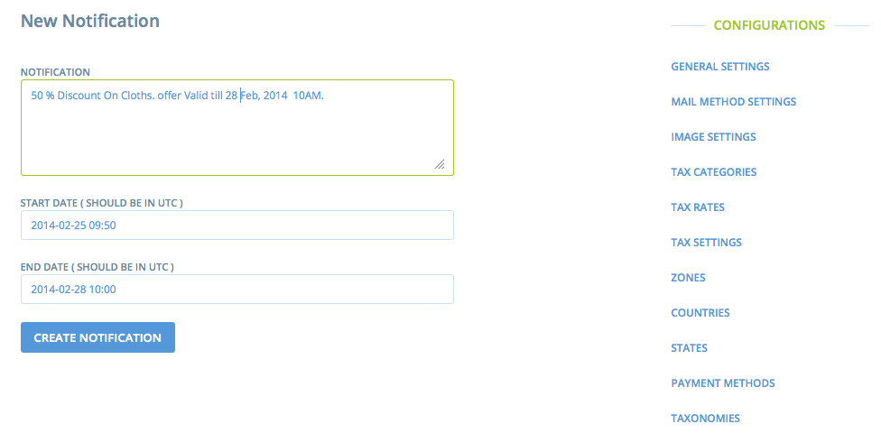
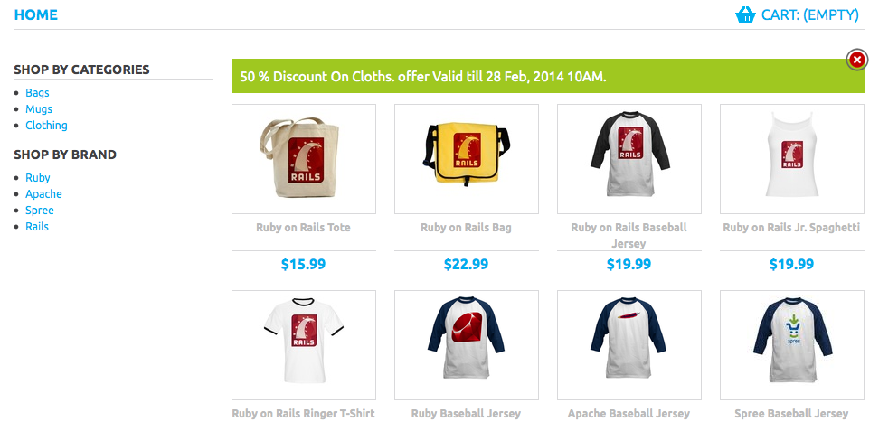

Spree Custom Notifications
========================

This gem is used to display custom notifications on Spree Store's Home page.

1. Spree Admin -

  Notification link is added in `Configuration Menu`.

  Admin is able to CURD on Notification.

2. Spree Store -

  If the notifications are disclosed by user, they are not displayed again during same session.

  The Notification is displayed during its start date and end date added
by admin while creating it.

Installation
------------

Add spree_custom_notifications to your Gemfile:

```ruby
gem 'spree_custom_notifications'
```

Bundle your dependencies and run the installation generator:

```shell
bundle
bundle exec rails g spree_custom_notifications:install
```

Example
-------
Please refer following screenshot to create custom notifications.

Admin can add sample notification.



On store, the Notifications are displayed as following:



Customization
-------------

You can customize the styling of notification by using spree
assets customization logic.

Refer -
[http://guides.spreecommerce.com/developer/asset.html](http://guides.spreecommerce.com/developer/asset.html)

Copyright (c) 2014 [Cuberoot Software](http://www.cuberoot.in), released under the New BSD License
